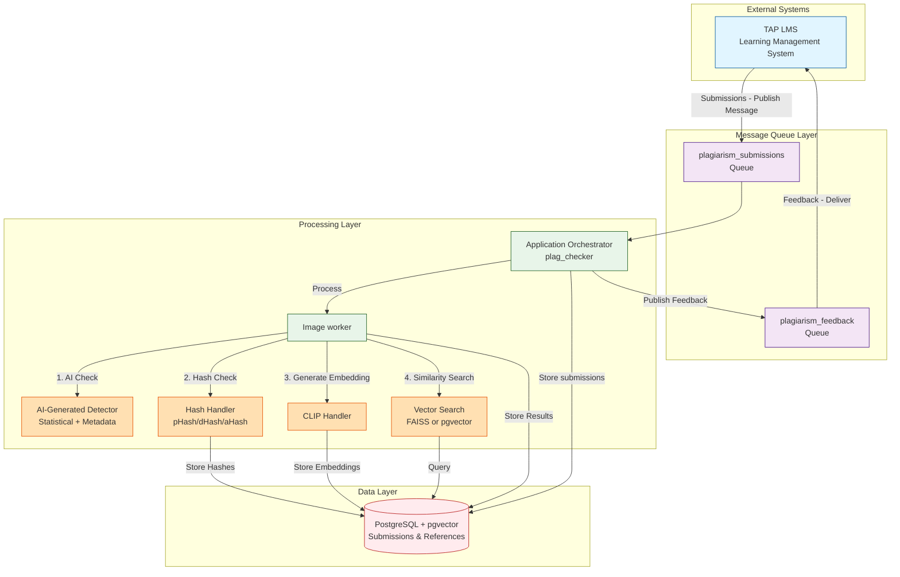

# MentorMe Image Plagiarism Detection System - Complete Documentation

## 1. Project Overview

### What It Does
The MentorMe Image Plagiarism Detection System is a **real-time, AI-powered plagiarism detection engine** designed specifically for educational institutions. It analyzes student image submissions to detect:

- **AI-Generated Images**: Identifies submissions created by DALL-E, Midjourney, Stable Diffusion, and other AI art generators
- **Peer Plagiarism**: Detects when students copy from each other's submissions
- **Reference Material Plagiarism**: Identifies unauthorized use of copyrighted or reference materials
- **Self-Plagiarism**: Tracks and flags resubmissions with configurable grace periods

### Business Problem It Solves
Educational institutions face critical challenges in maintaining academic integrity:

1. **Proliferation of AI-Generated Content**: Students increasingly use AI art generators to create submissions, bypassing learning objectives
2. **Peer Copying**: Students sharing and resubmitting identical or similar work across different assignments
3. **Unauthorized Material Use**: Students downloading copyrighted images from the internet and claiming them as original work
4. **Resubmission Gaming**: Students resubmitting old work for new assignments without additional effort
5. **Scale and Speed**: Manual verification of thousands of student submissions is time-consuming and inconsistent

### Target Users and Stakeholders
- **Primary Users**: Learning Management System (LMS) administrators and educators
- **Beneficiaries**: Students (honest ones benefit from fair evaluation), institutions (maintain academic standards)
- **Integrators**: TAP LMS platform operators, educational technology teams
- **System Administrators**: DevOps teams managing deployment and monitoring

### Expected Outcomes and KPIs

**Accuracy Metrics**:
- **Detection Rate**: 70-90% accuracy for exact matches (hash-based)
- **False Positive Rate**: <2% for semantic similarity detection
- **AI Detection Accuracy**: 70-95% depending on detection method (metadata vs. statistical)

**Business Impact**:
- **Reduce Manual Review**: Reduction in manual plagiarism verification time
- **Academic Integrity**: Measurable improvement in submission originality rates
- **Student Trust**: Transparent, data-driven academic integrity enforcement

---

## 2. Business Requirements

### Core Business Goals
1. **Real-Time Detection**: Provide immediate feedback on submission integrity within few seconds
2. **Multi-Layered Detection**: Use complementary techniques (hashing, semantic analysis, AI detection) for comprehensive coverage
3. **Scalability**: Handle peak loads during assignment deadlines (100+ submissions/minute)
4. **Privacy Compliance**: Hash student IDs (SHA-256) to protect personally identifiable information
5. **Integration-Ready**: Seamless RabbitMQ-based integration with existing LMS infrastructure


### Assumptions and Constraints

**Assumptions**:
- Image submissions are publicly accessible URLs (no authentication required)
- Supported formats: JPEG, PNG, WebP, BMP, GIF
- Maximum image size: 4096x4096 pixels (configurable)
- Students cannot manipulate EXIF metadata to evade detection

**Constraints**:
- **Infrastructure**: Requires 8GB+ RAM (CLIP model loading)
- **Storage**: 10GB+ disk space for FAISS index (scales with reference database)
- **Network**: Reliable internet access for image downloads
- **Database**: PostgreSQL 12+ with pgvector extension
- **Message Queue**: RabbitMQ 3.8+

---

## 3. System Architecture

### High-Level Architecture Diagram



### Component Descriptions

#### **1. Message Queue Layer** (RabbitMQ)
- **Purpose**: Decouples upstreaming from processing, ensures reliable message delivery
- **Queues**:
  - `plagiarism_submissions`: Incoming submission tasks (durable, persistent)
  - `plagiarism_feedback`: Outgoing plagiarism results (durable, persistent)
- **Features**: Prefetch count (1), message acknowledgment, dead-letter queue support
- **Data Flow**: API → submission queue → workers → feedback queue → LMS

#### **3. Processing Layer**
- **Application Orchestrator** (`app.py`): Manages lifecycle, signal handling, graceful shutdown
- **Submission Checker** (`submissions_checker.py`): Consumes messages, routes to processors, handles retries
- **Image Worker** (`worker.py`): Core plagiarism detection logic

#### **4. Detection Engines**

**a) AI-Generated Detector** (`ai_generated_detector.py`)
- **Methods**: Metadata inspection, statistical frequency analysis, noise pattern detection
- **Output**: Boolean flag + detection source + confidence (0.0-1.0)

**b) Hash Handler** (`hash_handler.py`)
- **Algorithms**: pHash (perceptual), dHash (difference), aHash (average)
- **Comparison**: Hamming distance (0-64 bits), threshold-based similarity
- **Use Case**: Fast exact/near-duplicate detection

**c) CLIP Handler** (`clip_handler.py`)
- **Model**: ViT-L/14 (laion2B-s32B-b82K pretrained weights)
- **Library**: open_clip_torch (downloaded from HuggingFace Hub)
- **Output**: 768-dimensional normalized embeddings
- **Download Source**: HuggingFace Hub (https://huggingface.co/laion/CLIP-ViT-L-14-laion2B-s32B-b82K)
- **Model Size**: ~3.5GB (downloaded on first run, cached locally)
- **Cache Location**: 
  - Linux/macOS: `~/.cache/huggingface/hub/`
  - Windows: `C:\Users\<username>\.cache\huggingface\hub\`
- **Features**: 
  - GPU support (CUDA) with automatic CPU fallback
  - Automatic HuggingFace download with local caching (no manual download needed)
  - Optional local model path for offline/air-gapped deployments
  - SSL verification toggle for corporate proxies
  - Fallback model loading strategy (tries multiple pretrained weights if primary fails)

**d) Vector Search**
- **FAISS** (`faiss_handler.py`): In-memory HNSW index for fast ANN search
- **pgvector** (`pgvector_handler.py`): PostgreSQL-native vector similarity search

#### **5. Data Layer**

**PostgreSQL Database** (`database/db_manager.py`)
- **Tables**:
  - `submissions`: Student submissions with hashes, embeddings, results
  - `reference_images`: Reference corpus for unauthorized material detection
  - `feedback_logs`: Audit trail for LMS feedback delivery
- **Connection Pooling**: asyncpg (5-20 connections)
- **Indexes**: B-tree (hashes, IDs), HNSW (vector embeddings)

**FAISS Index** (Optional)
- **Structure**: Flat index for exact search or HNSW for approximate search
- **Persistence**: Serialized to disk, loaded on startup
- **Metadata**: Separate JSON file mapping index positions to reference IDs

---

## 4. Flow Diagram

### Plagiarism Detection Flow (End-to-End)

```mermaid
flowchart TD
    Start([Student Submits Image via LMS]) --> PubMQ[Publish to RabbitMQ<br/>plagiarism_submissions]
    PubMQ --> Queue[(RabbitMQ Queue)]
    
    Queue --> Consumer{Worker Consumes<br/>Message}
    Consumer -->|Prefetch 1| ACK{Message Ack<br/>Manager}
    
    ACK --> Download[Download Image<br/>from img_url]
    Download -->|Retry 3x| ImgCheck
    
    ImgCheck --> |Resize| AICheck{AI-Generated<br/>Detection}
    AICheck -->|Check Metadata| MetaAI{EXIF Contains<br/>AI Platform?}
    MetaAI -->|Yes 95%| ShortCircuit[Short-Circuit<br/>Return AI Result]
    MetaAI -->|No| StatCheck{Statistical<br/>Analysis}
    StatCheck -->|Confidence >70%| ShortCircuit
    StatCheck -->|<70%| ContinuePlag[Continue Plagiarism<br/>Detection]
    
    ContinuePlag --> HashComp[Compute Hashes<br/>pHash/dHash/aHash]
    HashComp --> HashDB{Check DB<br/>Hash Matches?}
    HashDB -->|Hamming ≤8| ExactMatch[Flag: Exact Match<br/>Store Match Type]
    HashDB -->|No Match| CLIPEmbed[Generate CLIP<br/>Embedding 768D]
    
    CLIPEmbed --> VectorSearch{Vector Backend?}
    VectorSearch -->|FAISS| FAISSQuery[Query HNSW Index<br/>Top-K=10]
    VectorSearch -->|pgvector| PgQuery[SQL: ORDER BY<br/>embedding <#> query]
    
    FAISSQuery --> SimCheck{Similarity<br/>>Threshold?}
    PgQuery --> SimCheck
    SimCheck -->|>0.90| NearMatch[Flag: Near Match<br/>Store Similarity]
    SimCheck -->|0.80-0.90| SemanticMatch[Flag: Semantic Match]
    SimCheck -->|<0.80| NoMatch[No Match Found]
    
    ExactMatch --> PeerCheck{Peer Plagiarism<br/>Enabled?}
    NearMatch --> PeerCheck
    SemanticMatch --> PeerCheck
    NoMatch --> PeerCheck
    
    PeerCheck -->|Yes| QueryPeer[Query Same assign_id<br/>Different student_id]
    PeerCheck -->|No| SelfCheck{Self-Plagiarism<br/>Enabled?}
    QueryPeer --> PeerMatch{Matches<br/>Found?}
    PeerMatch -->|Yes| FlagPeer[Flag: Peer Plagiarism<br/>Store student_ids]
    PeerMatch -->|No| SelfCheck
    
    SelfCheck -->|Yes| QuerySelf[Query Same student_id<br/>Check Timestamp]
    SelfCheck -->|No| StoreDB
    QuerySelf --> Window{Within Grace<br/>Period 14d?}
    Window -->|Yes| AllowResubmit[Allow Resubmission<br/>Log Days Since Last]
    Window -->|No| FlagSelf[Flag: Self-Plagiarism<br/>Store submission_ids]
    
    FlagPeer --> StoreDB[(Store Results<br/>in PostgreSQL)]
    FlagSelf --> StoreDB
    AllowResubmit --> StoreDB
    ShortCircuit --> StoreDB
    
    StoreDB --> BuildFeedback[Build Feedback<br/>JSON Response]
    BuildFeedback --> PubFeedback[Publish to<br/>plagiarism_feedback]
    PubFeedback --> AckMsg[ACK Message]
    AckMsg --> FeedbackQueue[(Feedback Queue)]
    
    FeedbackQueue --> LMS[LMS Consumes<br/>GET /get-results]
    LMS --> End([Instructor Reviews<br/>Results])
    
    Reject --> |Any failure| DLQ[(Dead Letter Queue)]
    
    classDef inputOutput fill:#e1f5ff,stroke:#01579b
    classDef decision fill:#fff9c4,stroke:#f57f17
    classDef process fill:#e8f5e9,stroke:#1b5e20
    classDef storage fill:#ffebee,stroke:#b71c1c
    classDef error fill:#fce4ec,stroke:#880e4f
    
    class Start,End inputOutput
    class API,ImgCheck,MetaAI,StatCheck,HashDB,VectorSearch,SimCheck,PeerCheck,PeerMatch,SelfCheck,Window decision
    class GenID,PubMQ,Download,Resize,AICheck,HashComp,CLIPEmbed,FAISSQuery,PgQuery,QueryPeer,QuerySelf,BuildFeedback,PubFeedback,AckMsg process
    class Queue,StoreDB,FeedbackQueue,DLQ storage
    class Reject,ShortCircuit error
```



### Key Process Flows

**1. Fast-Path (AI Detection)**: 
- If AI-generated content detected with ≥70% confidence → Skip plagiarism checks → Return result
- **Latency**: ~500ms (metadata check) to ~2 seconds (statistical analysis)

**2. Hash-Based Detection**:
- Compute 3 hashes (pHash, dHash, aHash) → Query database for Hamming distance ≤8
- **Latency**: <1 second (indexed queries)

**3. Semantic Search**:
- Generate CLIP embedding → Vector search (FAISS or pgvector)
- **Latency**: 2-5 seconds (depends on index size)

**4. Peer/Self Checks**:
- Run after main detection → Filter by assignment/student → Check timestamps
- **Latency**: +500ms (parallel SQL queries)

---

## 5. Technical Design and Concepts

### Core Technologies and Frameworks

#### **Backend Framework: FastAPI**
- **Why Chosen**: 
  - Native async/await support for high-concurrency workloads
  - Automatic OpenAPI documentation generation
  - Built-in request validation with Pydantic
  - High performance (comparable to Node.js, Go)
- **Integration**: Handles HTTP → RabbitMQ conversion, result retrieval

#### **Message Queue: RabbitMQ + aio-pika**
- **Why Chosen**:
  - Industry-standard message broker with proven reliability
  - Durable queues ensure zero message loss during failures
  - Prefetch count enables parallel processing without overwhelming workers
  - Dead-letter queue support for poison message handling
- **Integration**: 
  - `mq/rmq_client.py`: Connection management, retry logic, graceful shutdown
  - `aio-pika`: Async Python client for RabbitMQ (AMQP 0.9.1)

#### **Database: PostgreSQL + asyncpg + pgvector**
- **Why Chosen**:
  - **PostgreSQL**: ACID compliance, JSONB support, robust indexing
  - **asyncpg**: Fastest async PostgreSQL driver for Python (3x faster than psycopg2)
  - **pgvector**: Native vector similarity search without external dependencies
- **Integration**:
  - Connection pooling (5-20 connections) for efficient resource usage
  - HNSW indexes for approximate nearest neighbor search
  - JSONB columns for flexible result storage

#### **Image Processing: Pillow + imagehash**
- **Why Chosen**:
  - **Pillow**: Industry-standard Python imaging library (resize, format conversion, EXIF parsing)
  - **imagehash**: Battle-tested perceptual hashing (pHash, dHash, aHash)
- **Integration**: Image download → resize → hash computation → CLIP preprocessing

#### **Machine Learning: open_clip_torch + PyTorch**
- **Why Chosen**:
  - **open_clip_torch**: Open-source CLIP implementation with better performance than original OpenAI CLIP
  - **ViT-L/14**: Larger Vision Transformer model (14 layers, 768D embeddings) for better semantic understanding
  - **laion2B-s32B-b82K**: Pretrained weights trained on 2 billion image-text pairs for robust representations
  - **HuggingFace Hub**: Automatic model download and caching from HuggingFace model repository
- **Integration**:
  - GPU acceleration (CUDA) when available, CPU fallback
  - Automatic download from HuggingFace on first run (~3.5GB model)
  - Local model caching in `~/.cache/huggingface/hub/` to avoid repeated downloads
  - Optional local model path for offline/air-gapped deployments
  - Embedding normalization (L2 norm = 1.0) for cosine similarity via dot product

#### **Vector Search: FAISS + pgvector**
- **Why Chosen**:
  - **FAISS**: Facebook's library optimized for billion-scale similarity search
  - **pgvector**: PostgreSQL-native alternative for simpler deployment
  - **HNSW Algorithm**: Hierarchical Navigable Small World graphs for fast ANN search
- **Integration**:
  - Toggle via `USE_PGVECTOR=true/false` in `.env`
  - FAISS: Standalone index file, faster queries
  - pgvector: Integrated with database, easier maintenance

#### **Configuration Management: Pydantic**
- **Why Chosen**:
  - Type-safe configuration with automatic validation
  - Environment variable parsing with fallbacks
  - Centralized config prevents scattered `os.getenv()` calls
- **Integration**: `config.py` defines all settings with validators

### Key Design Patterns

#### **1. Repository Pattern** (`database/db_manager.py`)
- **Purpose**: Encapsulate all database operations in a single class
- **Benefits**: 
  - Easy to mock for testing
  - Centralized connection pooling
  - Consistent error handling
- **Example**:
```python
class DatabaseManager:
    async def insert_submission_if_not_exists(self, data, image_url):
        # Encapsulated SQL logic
        ...
```

#### **2. Strategy Pattern** (Vector Search)
- **Purpose**: Switch between FAISS and pgvector without changing worker code
- **Implementation**:
```python
if config.vector_search.use_pgvector:
    self.vector_handler = PgVectorHandler(db_manager)
else:
    self.vector_handler = FAISSHandler(index_path, metadata_path)
```
- **Benefits**: Easy to add new backends (e.g., Weaviate, Milvus)

#### **3. Template Method Pattern** (`processors/base_processor.py`)
- **Purpose**: Define processing skeleton, let subclasses implement specifics
- **Implementation**:
```python
class BaseProcessor:
    async def process(self, data):
        await self.validate(data)
        result = await self.execute(data)
        await self.store_result(result)
        return result
```

#### **4. Singleton Pattern** (Database Pool)
- **Purpose**: Share single connection pool across all workers
- **Implementation**: Passed as `db_manager` parameter in constructors
- **Benefits**: Prevents connection exhaustion

#### **5. Context Manager Pattern** (Message Acknowledgment)
- **Purpose**: Guarantee exactly-once message acknowledgment
- **Implementation**:
```python
async with MessageAckManager(message) as ack:
    result = await process(message)
    await ack.ack()
# Automatic nack on exception
```
- **Benefits**: Prevents message loss and duplicate processing

#### **6. Factory Pattern** (`processors/__init__.py`)
- **Purpose**: Create appropriate processor based on submission type
- **Implementation**:
```python
def get_processor(submission_type):
    if submission_type == "image":
        return ImageProcessor()
    elif submission_type == "text":
        return TextProcessor()
```

### Technical Concepts

#### **Perceptual Hashing**
- **Concept**: Generate compact fingerprints invariant to minor image modifications
- **Algorithms**:
  - **pHash (Perceptual)**: DCT-based, robust to gamma correction
  - **dHash (Difference)**: Gradient-based, detects crops/borders
  - **aHash (Average)**: Mean-based, fast but less accurate
- **Comparison**: Hamming distance (count of differing bits)

#### **CLIP Embeddings**
- **Concept**: Map images to 768D semantic space where similar images cluster together
- **Architecture**: Vision Transformer (ViT-L/14) with 14 layers and 14x14 patch size
- **Library**: open_clip_torch (open-source implementation)
- **Source**: Downloaded from HuggingFace Hub on first run
- **Training**: Contrastive learning on 2B image-text pairs (LAION-2B dataset)
- **Normalization**: L2 normalization enables cosine similarity = dot product

#### **Vector Similarity Search**
- **HNSW (Hierarchical Navigable Small World)**:
  - Graph-based ANN algorithm
  - Trade-off: Speed vs. accuracy (controlled by `efSearch` parameter)
  - Complexity: O(log N) query time
- **Inner Product vs. Cosine**:
  - For normalized vectors: `inner_product(a, b) = cosine_similarity(a, b)`
  - Inner product is faster (no division)

#### **Async/Await Architecture**
- **Why**: Maximize I/O concurrency (database, HTTP, file I/O)
- **Libraries**: asyncpg (DB), aiohttp (HTTP), aio-pika (RabbitMQ)
- **Pattern**: Single-threaded event loop handles 10+ concurrent requests

---

## 6. Setup and Installation

### System Prerequisites

**Hardware Requirements**:
- **CPU**: 4+ cores (8+ recommended for production)
- **RAM**: 8GB minimum (CLIP model requires ~4GB)
- **Storage**: 10GB+ for FAISS index, 20GB+ for full deployment
- **GPU** (Optional): NVIDIA GPU with CUDA 11.8+ for 10x faster CLIP inference

**Software Requirements**:
- **Operating System**: Linux (Ubuntu 20.04+), macOS 11+, Windows 10+ (WSL2 recommended)
- **Python**: 3.10+ (3.11 recommended)
- **Podman** or **Docker**: Latest version
- **Git**: For cloning repository

### Environment Setup

#### 1. Clone Repository
```bash
git clone https://github.com/your-org/mentorme.git
cd mentorme
```

#### 2. Start Infrastructure (Automated)

**Windows (PowerShell)**:
```powershell
.\start-dev-env.ps1
```

**Linux/macOS (Bash)**:
```bash
chmod +x start-dev-env.sh
./start-dev-env.sh
```

**What This Does**:
-  Starts PostgreSQL (port 5432) in Podman container
-  Starts RabbitMQ (port 5672, management UI 15672) in Podman container
-  Initializes database schema (`database/init.sql`)
-  Applies migrations (`database/migrations/*.sql`)
-  Creates `.env` file with development defaults

#### 3. Create Python Virtual Environment
```bash
# Create virtual environment
python -m venv venv

# Activate (Windows)
.\venv\Scripts\Activate.ps1

# Activate (Linux/macOS)
source venv/bin/activate
```

#### 4. Install Python Dependencies

**Standard Installation (requires build tools)**
```bash
pip install --upgrade pip setuptools wheel
pip install -r requirements.txt
```

#### 5. Download CLIP Model (Optional - automatic on first run)

**Automatic Download**:
- The CLIP model (~3.5GB) is automatically downloaded from HuggingFace Hub on first run
- Cached locally in `~/.cache/huggingface/hub/` for subsequent runs
- No manual download required

**Manual Pre-download** (Recommended - for prod setup to avoid downloading multiple times):
```bash
# Download model manually using provided script
python scripts/download_clip_model.py

# Or download directly from HuggingFace
# URL: https://huggingface.co/laion/CLIP-ViT-L-14-laion2B-s32B-b82K
# Set CLIP_LOCAL_MODEL_PATH in .env to use local model
```

**HuggingFace Cache Location**:
- **Linux/macOS**: `~/.cache/huggingface/hub/`
- **Windows**: `C:\Users\<username>\.cache\huggingface\hub\`

### Environment Variable Configuration

**Edit `.env` file** (auto-generated by `start-dev-env.sh`):

```bash
# Database Configuration
POSTGRES_USER=postgres
POSTGRES_PASSWORD=postgres
POSTGRES_DB=plagiarism_db
POSTGRES_HOST=localhost
POSTGRES_PORT=5432
DB_MIN_POOL_SIZE=5
DB_MAX_POOL_SIZE=20

# RabbitMQ Configuration
RABBITMQ_HOST=localhost
RABBITMQ_PORT=5672
RABBITMQ_VHOST=/
RABBITMQ_USER=admin
RABBITMQ_PASS=admin123
SUBMISSION_QUEUE=plagiarism_submissions
FEEDBACK_QUEUE=plagiarism_feedback
RABBITMQ_PREFETCH_COUNT=10

# Detection Thresholds
EXACT_DUPLICATE_THRESHOLD=0.95
NEAR_DUPLICATE_THRESHOLD=0.90
SEMANTIC_MATCH_THRESHOLD=0.80
HASH_MATCH_THRESHOLD=8

# Vector Search Backend (FAISS or pgvector)
USE_PGVECTOR=false  # Set to true for pgvector
FAISS_INDEX_PATH=./models/faiss_index.bin
FAISS_METADATA_PATH=./models/faiss_metadata.json
FAISS_DIMENSION=768  # Must match CLIP model output dimension (768 for ViT-L/14)

# CLIP Model Configuration
CLIP_MODEL=ViT-L/14  # Vision Transformer Large with 14x14 patches (768D embeddings)
CLIP_DEVICE=cpu  # Use 'cuda' for GPU acceleration
CLIP_PRETRAINED=laion2B-s32B-b82K  # Pretrained weights from HuggingFace

# Local Model Path (Optional - for offline/air-gapped deployments)
# If set, loads model from this path instead of downloading from HuggingFace
# Download from: https://huggingface.co/laion/CLIP-ViT-L-14-laion2B-s32B-b82K
CLIP_LOCAL_MODEL_PATH=

# HuggingFace Download Settings
# Disable SSL verification only if encountering SSL certificate errors with corporate proxies
DISABLE_SSL_VERIFY=false
PYTHONHTTPSVERIFY=0

# Feature Flags
ENABLE_PEER_CHECK=true
ENABLE_SELF_CHECK=true
RESUBMISSION_WINDOW_DAYS=7
```

### Database Initialization

**Automatic (via start-dev-env.sh)**:
- Schema created automatically from `database/init.sql`
- Migrations applied from `database/migrations/`

**Manual (if needed)**:
```bash
# Connect to PostgreSQL
psql -h localhost -U postgres -d plagiarism_db

# Run schema
\i database/init.sql

# Run migrations
\i database/migrations/001_add_ai_detection.sql
```

### Seed Reference Images (Optional)

```bash
# Use the unified seeding script (recommended)
./seeding/seed-data.sh --ref-images

# Or seed reference images directly from directory
python seeding/seed_ref_images.py --directory path/to/reference/images

# With specific backends
python seeding/seed_ref_images.py --directory path/to/reference/images --use-pgvector --use-faiss

# Skip certain backends
python seeding/seed_ref_images.py --directory path/to/reference/images --no-faiss
```

---

## 7. Running the Application

### Local Development

#### Start All Services

**Terminal 1: Worker (Core Detection Engine)**
```bash
source venv/bin/activate
python app.py
```

**Terminal 2: API (REST Endpoints)**

Run this inside `api/` folder
```bash
source venv/bin/activate
uvicorn api:app --reload --host 0.0.0.0 --port 8000
```

#### Example API Usage

**Submit Image for Plagiarism Check**:
```bash
curl -X POST "http://localhost:8000/api/v1/submissions" \
  -d {"student_id":"ST1","assignment_id":"assignment-ai","image_url":"https://amadeusaichatbot.blob.core.windows.net/docbot-container/ChatGPT%20Image%20Nov%206,%202025,%2009_42_48%20AM.png"}
```

**Response**:
```json
{
  "status": "success",
  "submission_id": "4c9d14e3-228a-420b-9ea8-ce836f3b8bab",    
  "message": "Submission queued for plagiarism detection",    
  "timestamp": "2025-11-13T17:32:04.947069"
}
```

**Get Results**:
```bash
curl "http://localhost:8000/api/v1/get-results/ST001"
```

**Response**:
```json
Response:
{
  "student_id_hash": "f364a3305d70741f...",
  "results": [
    {
      "student_id": "f364a3305d70741f84b93e7d9b2a22b5cc3a28a3d3f2b80a6a99a1be703fef65",
      "submission_id": "4c9d14e3-228a-420b-9ea8-ce836f3b8bab",
      "img_url": "https://amadeusaichatbot.blob.core.windows.net/docbot-container/ChatGPT%20Image%20Nov%206,%202025,%2009_42_48%20AM.png",
      "assign_id": "assignment-ai",
      "submitted_at": "2025-11-13T17:32:04.882117",
      "similar_sources": [],
      "similarity_score": 0.99,
      "is_plagiarized": true,
      "match_type": "ai_generated"
    }
  ],
  "count": 1,
  "timestamp": "2025-11-13T17:32:34.485664"
}
```

### Running Tests

#### Unit Tests
```bash
# Run all tests (384 tests total)
pytest tests/

# Current test status:
# - 364 tests passing (94.8%)
# - 20 tests skipped (DB manager unit tests - covered by integration tests)
# - 0 tests failing
# - Execution time: ~7 minutes

# Run specific test file
pytest tests/test_hash_handler.py -v

# Run with coverage
pytest tests/ --cov=. --cov-report=html

# Run specific test categories
pytest tests/test_worker.py -v              # Integration tests (11 tests)
pytest tests/test_clip_handler.py -v        # CLIP handler tests (38 tests)
pytest tests/test_ai_detection.py -v        # AI detection tests (15 tests)
pytest tests/test_hash_handler.py -v        # Hash handler tests
pytest tests/test_faiss_handler.py -v       # FAISS vector search tests (22 tests)
pytest tests/test_image_validator.py -v     # Image validation tests (18 tests)
```

#### Test Organization

**Integration Tests** (`test_worker.py`):
- End-to-end plagiarism detection workflow
- Tests real business logic with mocked external dependencies
- 11 comprehensive tests covering all detection scenarios

**Unit Tests**:
- `test_clip_handler.py`: CLIP embedding generation and similarity (38 tests)
- `test_hash_handler.py`: Perceptual hashing algorithms
- `test_ai_detection.py`: AI-generated image detection (15 tests)
- `test_faiss_handler.py`: FAISS vector search (22 tests)
- `test_image_validator.py`: Image validation and security (18 tests)
- `test_plagiarism_logic.py`: Core detection logic
- `test_processors.py`: Message processing
- `test_security.py`: Security utilities

**Skipped Tests**:
- `test_db_manager.py`: 16 tests skipped (DB operations tested via integration tests)
- Other skipped tests: 4 tests (PIL/torch validation tests out of scope)


#### Test Database Connection
```bash
python -c "
import asyncio
from database.db_manager import DatabaseManager

async def test():
    db = DatabaseManager()
    await db.init_pool()
    print(' Database connected successfully')
    await db.close()

asyncio.run(test())
"
```

### Docker Deployment

#### Build Docker Image
```bash
# Standard build (model downloaded on first run)
docker build -t plg:latest .

# With HuggingFace token for model prefetch during build (optional)
# This pre-downloads the CLIP model into the Docker image
docker build -t plg:latest \
  --build-arg HUGGINGFACE_HUB_TOKEN=your_token_here .

# Note: HuggingFace token is optional - public models can be downloaded without authentication
# Token only needed for private models or to avoid rate limits
```

#### Run with Docker Compose
```bash
# Start all services (PostgreSQL, RabbitMQ, Worker, API)
docker-compose up -d

# View logs
docker-compose logs -f worker

# Stop all services
docker-compose down
```

#### Environment Variables for Docker
```yaml
# docker-compose.yml snippet
services:
  worker:
    image: plg:latest
    environment:
      - POSTGRES_HOST=postgres
      - RABBITMQ_HOST=rabbitmq
      - USE_PGVECTOR=true
      - CLIP_DEVICE=cpu
    depends_on:
      - postgres
      - rabbitmq
```

### Monitoring and Health Checks

#### RabbitMQ Management UI
- **URL**: http://localhost:15672
- **Credentials**: admin / admin123
- **Features**: Queue monitoring, message rates, consumer status

---

## 8. Deployment Details

### Production Configuration Checklist

**Security**:
-  Enable SSL/TLS for API endpoints (Let's Encrypt or Cloud Load Balancer)
-  Use Secret Manager for credentials (Google Secret Manager, Vault)
-  Enable VPC firewall rules (PostgreSQL: internal only, RabbitMQ: internal only)
-  Hash student IDs with SHA-256 (privacy compliance)

**Performance**:
-  Use pgvector for integrated deployment (no separate FAISS index)
-  Configure connection pooling (`DB_MIN_POOL_SIZE=10, DB_MAX_POOL_SIZE=50`)
-  Set RabbitMQ prefetch count based on worker count (`RABBITMQ_PREFETCH_COUNT=10`)

**Monitoring**:
-  Set up Prometheus metrics export (worker latency, queue depth)
-  Configure Grafana dashboards (plagiarism detection rate, AI detection rate)
-  Enable Cloud Logging (structured JSON logs)
-  Set up alerting (Slack/PagerDuty for queue backlog >1000)
-  RabbitMQ message persistence enabled (`durable=True`)

---

## 9. Future Improvements

**1. Performance Optimization**
- Implement CLIP embedding batch processing and caching to reduce redundant computation
- Optimize database queries with proper indexing, materialized views, and Redis caching
- Tune FAISS index parameters and connection pooling for better throughput

**2. Enhanced AI Detection Validation**
- Add ensemble voting across multiple detection methods (metadata, noise analysis, compression artifacts)
- Implement confidence calibration using validated datasets of AI-generated vs human-created images
- Build validation pipeline with human-in-the-loop review for continuous improvement

**3. Reverse Image Search Integration**
- Integrate Google Reverse Image Search, TinEye, and Bing Visual Search APIs
- Build automated web crawler for common stock photo sites (Unsplash, Pexels, Shutterstock)
- Implement source attribution and automatic reference database updates

**4. Advanced Similarity Detection**
- Add SSIM, color histogram matching, and SIFT/ORB feature matching for robust comparison
- Implement multi-scale and rotation-invariant matching for cropped/transformed images
- Support additional similarity metrics for different art styles (sketches, line art, textures)

**5. Monitoring and Reporting**
- Build lightweight dashboard for queue depth, processing rates, and detection statistics
- Implement visual evidence generation with side-by-side comparisons and similarity heatmaps
- Add instructor workflow tools for case review, annotations, and student notifications

---